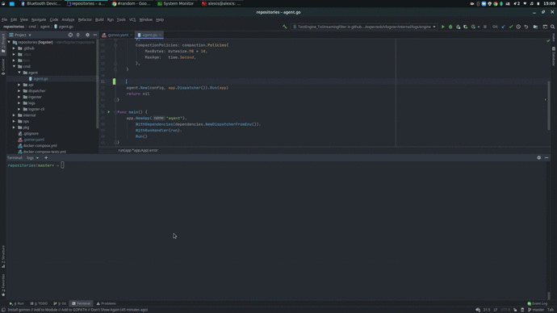

### Gomon

Gomon is a tool to launch multiples apps at the same time with hot reloading support. 

It will only reload the application if the modified file is contained in a package imported by this application.

#### Demo



#### Install

`go install github.com/expectedsh/gomon/...`

#### How to use

1. Create a `.gomon.yaml` at the root of your repository. Check the example below to understand how it works:
    ```yaml
    - name: ingester
      path: "cmd/ingester/ingester.go"
      color: purple
      env:
        KAFKA_CONSUMER_GROUP: ingester
    
    - name: logs
      path: "cmd/logs/logs.go"
      color: cyan
    ```
2. Launch `gomon run` :D
